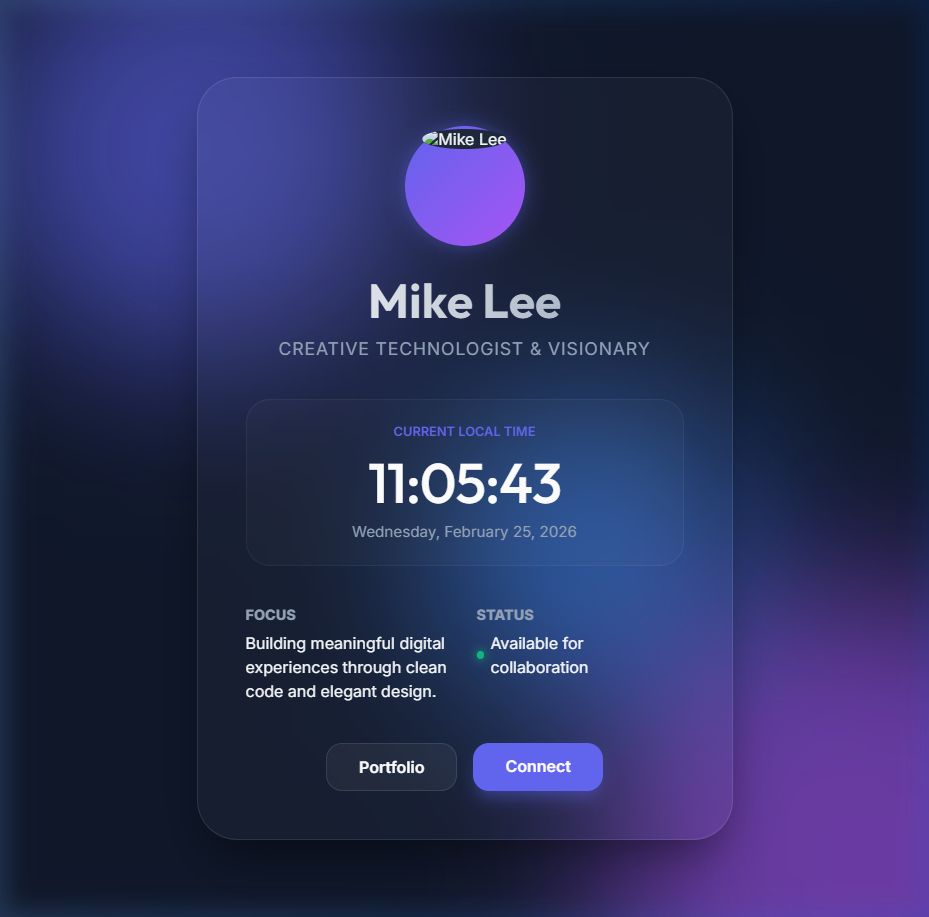

# Project Summary - Mike Lee Personal Page

## Resulting Homepage

## Overview
This project involved creating a high-end, responsive personal landing page for Mike Lee. The design focuses on modern aesthetics, utilizing glassmorphism, animated backgrounds, and a real-time digital clock.

## Key Features
- **Real-time Clock**: A JavaScript-powered clock that updates every second.
- **Modern UI**: Built with Vanilla CSS, featuring glassmorphism and animated blobs.
- **Responsive Design**: Optimized for seamless viewing on all devices.
- **Profile Image**: A professional AI-generated portrait.

## Technical Stack
- **Structure**: HTML5
- **Styling**: Vanilla CSS (Glassmorphism, Animations)
- **Logic**: Vanilla JavaScript
- **Version Control**: Git & GitHub

## Repository
Final code is hosted at: [https://github.com/Amu-Mike/0225DRL-DIC1.git](https://github.com/Amu-Mike/0225DRL-DIC1.git)
